  

MindMesh is a sophisticated AI orchestration platform that eliminates hallucinations and bias by forcing multiple Large Language Models (LLMs) into a structured, adversarial debate. It doesn't just ask an AI for an answer—it stress-tests the logic through a rigorous multi-stage verification process.

---

## 🏛 The Architecture of Truth

MindMesh utilizes a 4-agent hierarchy to ensure the highest possible factual accuracy and logical depth:

### 1. 💡 The Proposer
Generates the initial comprehensive response. It focuses on depth, breadth, and clarity, setting the foundation for the debate.
*   **Default Engine:** Llama 3.3 70B (via Groq)

### 2. 🛡️ The Challenger
Acts as a rigorous devil's advocate. It aggressively hunts for logical fallacies, hidden biases, and factual hallucinations in the Proposer's work.
*   **Default Engine:** Gemma 3 27B (via Google)

### 3. ⚖️ The Arbitrator
Impartially reviews the debate. It evaluates the strength of the Proposer's arguments against the Challenger's critiques, assigning confidence scores and determining a winner.
*   **Default Engine:** Qwen 3 235B (via Cerebras)

### 4. ✨ The Synthesizer
The final master writer. It takes the entire debate history and the Arbitrator's verdict to craft a definitive, nuanced, and verified final response.
*   **Default Engine:** Gemini 2.5 Flash (via Google)

---

## 🚀 Key Features

*   **Adversarial Verification:** Automatically catches errors that single LLMs often miss by forcing a "second opinion" that is incentivized to find flaws.
*   **Provider Agnostic Router:** Built-in resilience with automatic failover between Groq, Cerebras, Google, and OpenAI to ensure 100% uptime.
*   **Full-Stack UI:** A modern, premium Next.js dashboard featuring glassmorphic design and real-time animation of the debate process.
*   **Persistent History:** Integrated with Neon PostgreSQL and Clerk Auth for secure, cloud-synced debate history.
*   **Sharable Results:** Generate public links for any debate session to share findings with others.

---

## 🛠 Tech Stack

### Backend
- **Python / FastAPI**: High-performance asynchronous API orchestration.
- **Pydantic**: Type-safe data modeling and validation.
- **LLM SDKs**: Native integration with Google Generative AI, Groq, and OpenAI.

### Frontend
- **Next.js 15**: React framework with App Router architecture.
- **Tailwind CSS**: Custom premium design system with dark mode priority.
- **Framer Motion**: Smooth, physics-based animations for the debate flow.
- **Clerk**: Professional-grade authentication and user management.
- **Neon**: Serverless PostgreSQL for persistent storage.

---

## ⚖️ License

MindMesh is open-source software licensed under the [MIT License](LICENSE).

---

  Built with ❤️ for the future of reliable AI.

